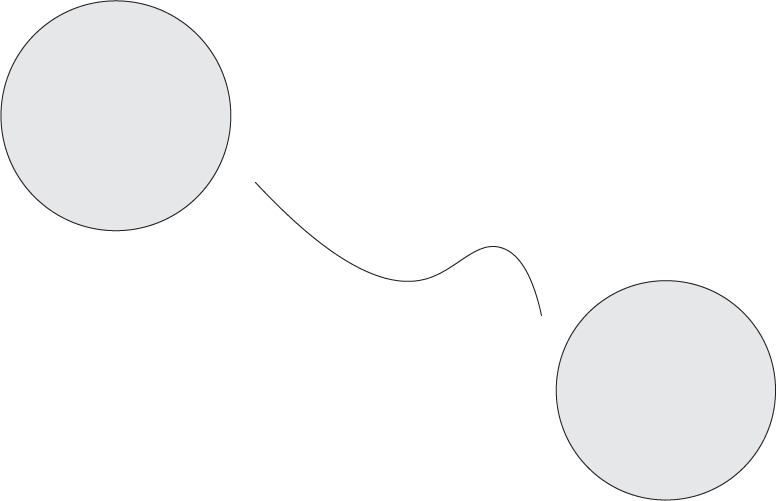

**Trabajo Practico 1: Implementacion de un AFD para GR**

Modo de uso
Se crea un archivo [*entrada.txt*](entrada.text) listando cadenas de cualquier tipo, separadas por comas.
Las cadenas reconocidas seran las correspondientes a numeros en los sistemas DECIMAL (base 10), OCTAL (base 8) y HEXADECIMAL (base 16).

El programa implementa los estados finales, intermedios y pozo, representados en la siguiente figura.

